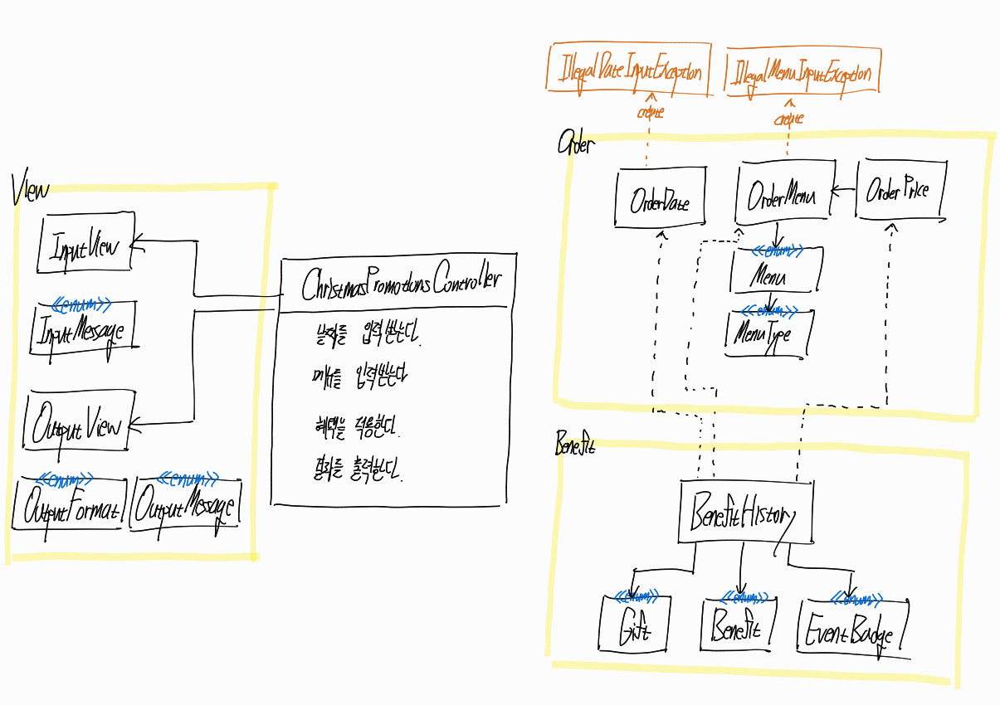

# 객체 설계 다이어그램

# 기능 구현 목록
### 입력
- [x] 빈 값이 오지 않았는지 확인한다
### `OrderDate`
- [x] 날짜를 입력받는다
  - [x] 날짜가 숫자인지 확인한다
  - [x] 날짜가 1일부터 31일 사이인지 확인한다
### `OrderMenu`
- [x] 주문 목록을 입력받는다
  - [x] 형식에 맞게 주문했는지 확인한다("-" 포맷팅 준수 여부)
  - [x] 주문 메뉴가 존재하는지 확인한다
  - [x] 주문 메뉴가 중복되는지 확인한다
  - [x] 주문 갯수가 숫자인지 확인한다
  - [x] 주문 갯수가 1개 이상 20개 이하인지 확인한다
### `OrderPrice`
- [x] 주문 목록에서 총 주문 가격을 생성한다
  - [x] 총 주문 가격이 1만원이 넘는지 확인한다
### `Controller`
- [x] 혜택 적용 조건을 두어 조건을 만족하면 혜택을 적용한다
  - [x] 음료만 주문했는지 확인한다 
  - [x] 총 주문 금액이 10,000원이 넘는지 확인한다
### `BenefitHistory`
- [x] 할인 내역을 생성한다
- [x] 이벤트에 따라 할인 내역을 추가한다(DiscountService에서 사용)
- [x] 샴페인을 증정한다
  - [x] 총 주문 금액이 120,000원이 넘는지 확인한다
  - [x] 샴페인 1개를 선물에 추가하고 할인 내역에 포함한다
- [x] 뱃지를 부여한다
  - [x] 총 혜택 가격이 5,000원 이상이면 '별' 뱃지를 부여한다
  - [x] 총 혜택 가격이 10,000원 이상이면 '트리' 뱃지를 부여한다
  - [x] 총 혜택 가격이 20,000원 이상이면 '산타' 뱃지를 부여한다
### `DiscountService`
- [x] 크리스마스 디데이 할인 정책을 적용한다
  - [x] 할인 정책 적용 기간인지 확인한다
  - [x] 기간 별로 혜택 금액을 계산해서 할인 내역에 포함한다
- [x] 일주일 할인 정책을 적용한다
  - [x] 주문 날짜가 주말일 경우 주문 메뉴 목록에서 '디저트' 메뉴의 갯수만큼 할인한 후 할인 내역에 포함한다
  - [x] 주문 날짜가 평일일 경우 주문 메뉴 목록에서 '메인' 메뉴의 갯수만큼 할인한 후 할인 내역에 포함한다
- [x] 특별 할인 정책을 적용한다
  - [x] 별이 있는 날짜인지 확인한다
  - [x] 1,000원 할인 후 할인 내역에 포함한다
### 출력
- [x] 혜택 적용 전 주문 내용을 보여준다
- [x] 혜택 적용 후 혜택 내역을 보여준다